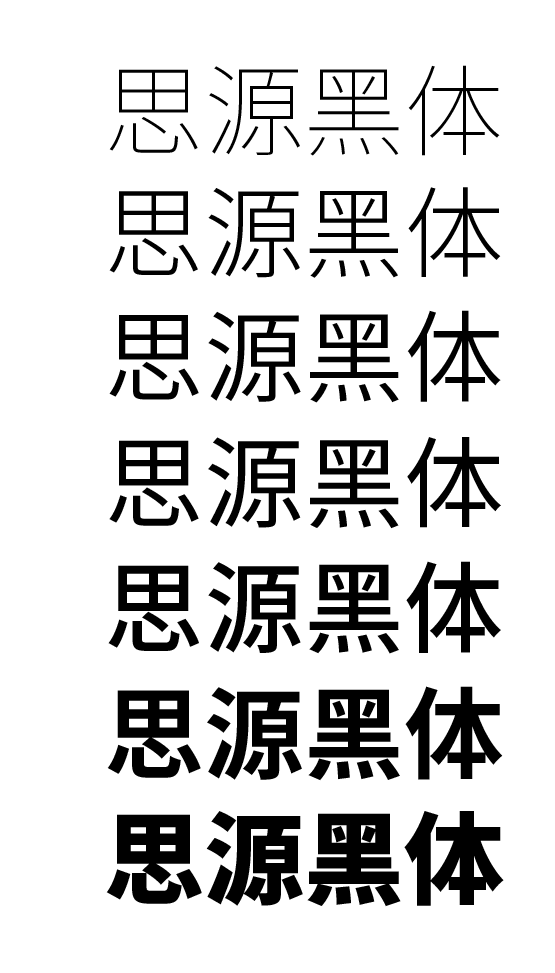

## [Google’s signature font](http://google-opensource.blogspot.my/2015/05/roboto-googles-signature-font-is-now.html) - [Roboto](https://github.com/google/roboto)
It is the default font used in Android and Chrome OS, and is the recommended font for Google’s visual language, Material Design.

[WiKi](https://zh.wikipedia.org/wiki/Roboto)  
[Roboto Character Set](https://www.google.com/fonts/specimen/Roboto)  
[Google Fonts API for Roboto](https://www.google.com/fonts#UsePlace:use/Collection:Roboto)

[缓存 Google 字体副本](http://ju.outofmemory.cn/entry/88873)([Noto Serif](http://www.1001fonts.com/noto-serif-font.html)/[Open Sans](http://www.1001fonts.com/open-sans-font.html))  
[WOFF 和 Google Font API](https://swordair.com/woff-and-google-font-api/)  

## [思源黑体](https://zh.wikipedia.org/wiki/%E6%80%9D%E6%BA%90%E9%BB%91%E9%AB%94)
Source Han Sans / Noto Sans CJK（下称 SHS）这个项目是由 Google 委托 Adobe，并联合日本 Iwata（主要负责字符集扩充）、中国常州华文（SinoType，主要负责字形的中国大陆标准与台湾「国字标准字体」本地化）、韩国 Sandoll（主要负责韩文设计）共同完成的。这项目的规模在 CJK 领域应该也是史无前例的。

Google 方面的需求是制作一款覆盖四个 CJK locale 的 pan-CJK 字体，与 Noto 搭配用于 Chrome OS 等场合。

### [思源黑體](http://blog.typekit.com/alternate/source-han-sans-chs/) [Noto Sans CJK = Source Han Sans](http://acrossbeta.blogspot.com/2014/09/blog-post_8.html)
Noto Sans CJK 是 Google 和 Adobe 在 2014 年联合发布的供桌面使用的开源 Pan-CJK 字体家族。CJK 为中文（Chinese）、日文（Japanese）和韩文（Korean）的缩写，完美支持日文、韩文、繁体中文和简体中文。

Google 将其纳入 **Noto** pan-Unicode 字体家族，推出的这一字体系列称为 Noto Sans CJK ；而 Adobe 则把它包含进了自家的 **Source Sans** 家族。

[思源黑体的各个版本有什么不同](https://www.zhihu.com/question/24639343)  
[Source Han Sans 与 Noto Sans 的区别](https://qdan.me/list/VLPe5sfsxkFWYMmX)  

#### [Google Noto Fonts](https://www.google.com/get/noto/) - [S Chinese](https://www.google.com/get/noto/help/cjk/) / [Noto-Sans-CJK-SC](https://noto-website-2.storage.googleapis.com/pkgs/NotoSansCJKsc-hinted.zip)  

> Beautiful and free fonts for all languages

就英文名（Noto Sans CJK 、 Source Han Sans）來看: Google 原本就有 Noto 字型計畫，目的就是要消滅豆腐字([tofu](http://www.1001fonts.com/noto-serif-font.html)，係指文章因為缺字出現如豆腐方塊的情形)，所以 Noto 其實是 No Tofu（沒豆腐）。

Google 要求该字体与其 Roboto 和 Noto Sans 字体家族完美配合，Web 网页端使用较多。

#### [Adobe Category: Noto Sans](http://blogs.adobe.com/conversations/tag/noto-sans) -  [Source Han Sans](https://github.com/adobe-fonts/source-han-sans)

> [AN OPEN SOURCE PAN-CJK TYPEFACE](http://blogs.adobe.com/conversations/2014/07/introducing-source-han-sans-an-open-source-pan-cjk-typeface.html)  
> [Adobe TypeKit](https://typekit.com/fonts?licenses=desktop&sort=newest)  

至於 Adobe 自己的 Source Sans Pro，是一個開放的多功能字型家族，Source Han Sans 開發過程中也納入 Source Sans 的拉丁文字符、希臘文和斯拉夫文字符。

Adobe Source Han Sans 发布版字符比较完备，建议用作桌面显示。

##### [Source Code Pro](https://github.com/adobe-fonts/source-code-pro)
是不是对应的 Mono 版本，类似 Noto Sans Mono CJK？

#### [使用思源黑体](http://www.iinterest.net/2015/01/29/%E4%BD%BF%E7%94%A8%E6%80%9D%E6%BA%90%E9%BB%91%E4%BD%93/)
[使用 Noto Sans CJK 作为网页字体](https://leonax.net/p/7750/use-noto-sans-cjk-as-default-blog-font/)  
[思源/Noto pan-CJK 字體 & Ubuntu](http://blog.anthonywong.net/2014/07/28/%E6%80%9D%E6%BA%90noto-pan-cjk-%E5%AD%97%E9%AB%94-ubuntu/)  

如果想在 HTML 文档中把思源黑体作为一种备选字体，可以在 CSS 中加入：

```CSS
body{ 
    font-family:"Noto Sans CJK SC", "Source Han Sans CN";
    /*思源黑体7种字体粗细，在 CSS 中也可以指定：*/
    /*font-family:"Noto Sans CJK SC Thin", "Source Han Sans CN Thin";*/
    /*font-family:"Noto Sans CJK SC Light", "Source Han Sans CN Light";*/
    /*font-family:"Noto Sans CJK SC DemiLight", "Source Han Sans CN DemiLight";*/
    /*font-family:"Noto Sans CJK SC Medium", "Source Han Sans CN Medium";*/
    /*font-family:"Noto Sans CJK SC Blod", "Source Han Sans CN Blod";*/
    /*font-family:"Noto Sans CJK SC Black", "Source Han Sans CN Black";*/
}
```

### [如何评价思源黑体字族](https://www.zhihu.com/question/24499749)
思源黑体是重心置中、字面稍大的现代黑体。它空间取向均称，以一般用家们耳熟能详的字体去比喻，则可以归类成兰亭黑、俪黑一类**中宫外放**，给人感觉较轻松友善的现代黑体，与「黑体－简」走相反路线。

思源黑体也许是质量最高的开源汉字字体。  
如果说以中易黑体为代表的黑体是“经典黑体”，以微软雅黑为代表的是“现代黑体”，那么思源黑体是介于这两者之间的。冬青黑体与华康黑体（据说 Droid Sans Fallback 也是基于华康黑体）也大致处于这个位置。  
思源黑体没有冬青的喇叭口和小塚的衬线，更几何化，更容易搭配，Adobe 和 Google 如此设计，应该是为了与 Source Sans、Noto 系列、Roboto 等字体一起使用。与 Helvetica、Arial 等常用的无衬线字体搭配也不在话下，可谓是一款百搭的字体。  
> --豆腐君

从内文字字号去看，则发现思源黑体的字间距虽然比我们在 iOS 常见「黑体－简」要窄小，却比雅黑、兰亭黑要多一点空间，就跟冬青黑体一类日本西来的汉字字型同出一系。

个人意见，感觉现代、字面率较大而又备有一定字间距空间的字体**适合电子阅读环境**。思源黑体结构风格既现代，也备有一定间距空间，设计定位刚好在于`黑体－简`、`雅黑`之间。从应用设计师、网站设计角度看，iOS 提倡的、引起的平面化使用环境，便必须要有感觉现代的字体配合才没有违和感。思源黑体的出现为我们中华地区用家这感触良多的问题提供一个绝佳的解决方案。

### 七种字重
Noto-Sans-CJK-SC / Source-Han-Sans

- Thin/ExtraLight（细体/加细体）
- Light（轻度）
- [DemiLight/Normal](https://www.zhihu.com/question/24607502)（正常），Source-Han-Sans 默认字号。
- Regular（常规），Noto-Sans-CJK-SC 默认字号。
- Medium（中等）
- Bold（粗体）
- Black/Heavy（黑色/特黑）

Noto-Sans-Mono-CJK-SC / Source-Han-Sans-HW-SC

- Regular
- Bold



思源黑体七个字重，基本便解决了中港台多年来电子阅读、网路环境用的字体字重不够而设计被逼多利用资讯层级（information hierarchy）作资料分级分类的应用问题。

除了两个字重极端字重（Extreme weight）—— ExtraLight 和 Heavy 外，思源黑体亮点更在于 Normal 和 Regular。

#### Regular/Normal 区别 1
或许网友会问「这个极相像的字重他们推出来干吗？」。给大家提示：Normal 用在光亮底色网站壁纸，Regular 则用在暗色、黑色壁纸上；或 Normal 用在 iPad app 上，Regular 用在 iPhone app 上。换句话说，Normal 跟 Regular 是要互作光度补偿的字重，背后的思考方法十分新颖。

基于屏幕的像素密度不同，同一字重的字体在不同屏幕上粗度就会有字重分别，白色底色跟黑色底色造成的光晕效果也是一样。Normal 跟 Regular 两个字重刚好可以互相补足解决上述问题。

#### Regular/Normal 区别 2
第七个字重却是与 Noto Sans 和 Roboto 字体的字重相互调谐的产物。倘若让 Normal 字重代替第七个字重（现在的 Regular 字重）、与 Noto Sans 或 Roboto 混搭的话，肯定会有更惹人注目的视觉差异。

#### [字重适用](http://huaban.com/pins/512117516/)

12sp 小字提示  
14sp（桌面端13sp） 正文/按钮文字  
16sp（桌面端15sp） 小标题  
20sp Appbar 文字  
24sp 大标题  
34sp/45sp/56sp/112sp 超大号文字  

长篇幅正文，每行建议60字符（英文）左右。  
短文本，建议每行30字符（英文）左右。  

## 参考

- [思源黑體：Source Han Sans，免費下載](https://free.com.tw/source-han-sans-noto-sans/)  
- [全套思源黑体字体（免费商用）打包下载](http://www.digitaling.com/articles/17462.html) [Noto-Sans-S-Chinese](http://pan.baidu.com/s/1uJBBK)  


