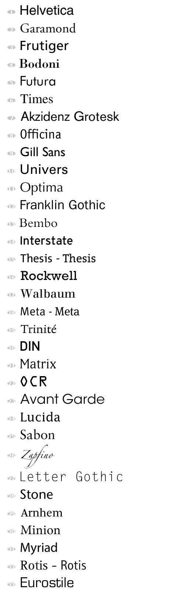

- ***font guides***

[网页字体排印指南](http://www.jianshu.com/p/0ae5de404e75)  
[网页中的字体到底该怎么选择？](http://www.jianshu.com/p/81d4486bc816)  

- ***font choices***

[Which Font Should I Use for My Web Page?](https://www.thesitewizard.com/webdesign/which-fonts-to-use.shtml)  
[What Font Should I Use? ](http://drmarkwomack.com/a-writing-handbook/style/typography/)  
[5 Principles for Choosing and Using Typefaces](https://www.smashingmagazine.com/2010/12/what-font-should-i-use-five-principles-for-choosing-and-using-typefaces/)  
[***font choices***](https://designschool.canva.com/font-design/)  

[中文网页用什么字体最合适？](https://www.zhihu.com/question/20404847)  
[**有哪些值得推荐的英文字体？**](https://www.zhihu.com/question/23210530)  

[网页设计中最常用的字体](http://www.cnblogs.com/fxair/p/3495004.html)  
[网页设计中最常用的字体有哪些？（中文和英文）](https://www.zhihu.com/question/19680724)  

- ***fonts recommend***

[网页设计中常用的8款字体](http://www.jianshu.com/p/66f66e9e0d56)  
[网页设计中最常见的30款英文字体](http://www.uisdc.com/30-west-typegraph-in-web-design)  
[常用中文字体推荐](http://blog.sina.com.cn/s/blog_a737d07c01013kwi.html)  

> 方正中黑、方正姚体、蒙纳简超刚黑、汉仪菱心简、冬青黑体、康熙字典体

mac 用户优先选择 `苹方`，win 用户优先选择 `微软雅黑`。

```CSS
font-family: "PingFang SC", "Helvetica Neue", "Hiragino Sans GB", "Microsoft YaHei", "微软雅黑", Helvetica, Arial, Verdana, sans-serif;
```

## 中文字体
1. 微软雅黑体（Microsoft YaHei）  
2. 苹方-简（San Francisco+PingFang）  
3. 冬青黑体（Hiragino Sans GB）  
4. 兰亭黑-简（Lantinghei SC）  
5. 思源黑体（Noto Sans CJK/Source Han Sans）  

## 英文字体


### Sans-serif
**常用**：

- Helvetica Neue  
- *Helvetica*  
- Arial  
- Verdana  
- Tahoma  
- Lucida Grande  

**青睐**：

- *Gill Sans*(英伦风情，古典风格骨架，BBC LOGO)  
- Myriad Pro(替换Garamond)  
- Roboto  
- Noto Sans(No Tofu)  

**其他**：

- Futura(几何特征，LV商标及众多杂志首选字体)  
- Univers(比Helvetica更加简练)  
- Optima(黄金分割气质优雅，越战纪念碑，时代周刊，雅虎2013全新标识)  
- Avenir(改进Futura)  
- Gotham(美国街头传统字体)  

### Serif
- Courier/Courier New(旧式打印机字体)  
- Times New Roman(过渡型衬线，英文paper字体)  
- *Georgia*  
- Noto Serif(No Tofu)  
- Garamond(Adobe Garamond Pro）  
- Caslon(Adobe Caslon Pro）  
- Didot  
- Bodoni  

Didot 和 Bodini 一起几乎统治了整个 19 世纪的出版业。
时尚杂志 Vogue 的标题字体使用的就是经过改良的 Didot。 
